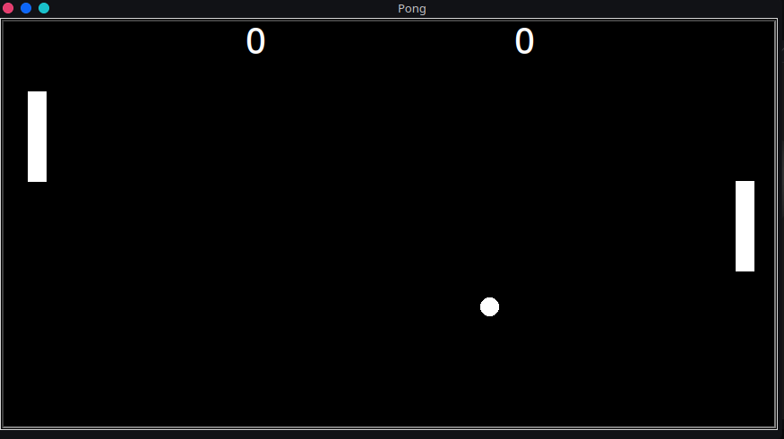

# Pong Python

This is legendary pong game in python.

  

## Functionality:

- [x] Paddle movement
- [x] Ball movement
- [x] Ball Physics
- [x] Score for each player
- [x] Ball Speed

## How to play

1. Use WA to move left peddle and Up down Arrow to move right paddle.
2. hit the ball
3. Don't hit miss and score point
4. Have fun!

## Screenshot

  

## Installation

1. Download latest release from [here](https://github.com/Prakash4844/Pong-Python/releases/tag/V1.0)
2. Extract the lzma file using 7zip or any other software
3. Run the executable file

